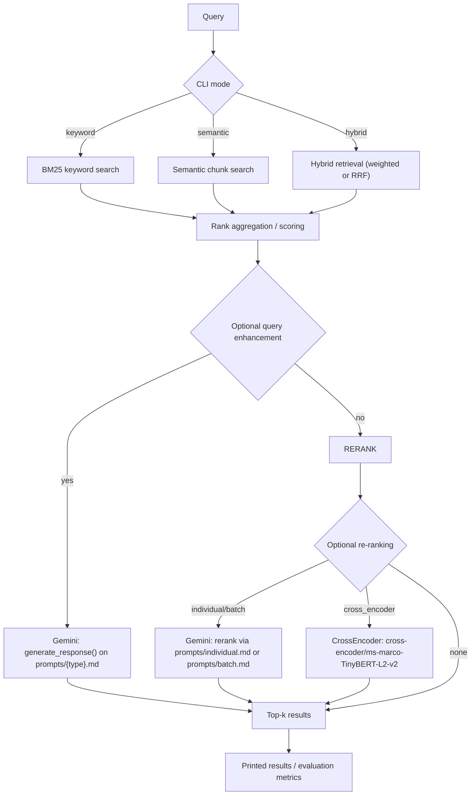

# RAG-search-engine

## Overview

This repo provides a small retrieval-augmented search engine with:

* Keyword retrieval using a BM25-style inverted index (`cli/lib/keyword_search.py`)
* Semantic retrieval using sentence-transformer embeddings over chunks (`cli/lib/semantic_search.py`)
* Hybrid retrieval using either:
  * Weighted combination (`weighted_search`)
  * Reciprocal Rank Fusion (`rrf_search`)
* Optional query enhancement and LLM-based re-ranking via the Gemini API (`cli/lib/llm.py`)

All user-facing CLIs are defined as `argparse` entrypoints under [`cli/`](cli/), with filenames like `*_cli.py`.

## Project Flow

## Quickstart

1. Install dependencies with `uv`:
   * `uv sync --frozen`
2. Create a local `.env` (not committed):
   * `HF_TOKEN`
   * `GEMINI_API_KEY`
3. Add required data files (not committed; see `.gitignore`):
   * `data/movies.json`
   * `data/stopwords.txt`
   * `data/golden_dataset.json` (needed for `evaluation_cli.py`; optional for pure retrieval)
4. Optional: precompute caches (recommended for faster startup):
   * `python3 cli/keyword_search_cli.py build`
   * `python3 cli/semantic_search_cli.py embed_chunks`

Example hybrid search:

* `python3 cli/hybrid_search_cli.py rrf_search "cute british bear marmalade" --limit 5`

Example with enhancement + cross-encoder re-ranking:

* `python3 cli/hybrid_search_cli.py rrf_search "cute british bear marmalade" --enhance rewrite --rerank-method cross_encoder --limit 5`

## Models & Environment Variables

* Embedding model (semantic retrieval): `sentence-transformers/all-MiniLM-L6-v2`
* LLM model (Gemini API): default `gemma-3-27b-it` (used by `cli/lib/llm.py::generate_response()`)
* Re-ranker model:
  * Cross-encoder: `cross-encoder/ms-marco-TinyBERT-L2-v2` (used when `--rerank-method cross_encoder`)
* Environment variables:
  * `HF_TOKEN`: required for Hugging Face model downloads (embeddings + cross-encoder)
  * `GEMINI_API_KEY`: required for Gemini API calls (enhancement + reranking + evaluation LLM scoring)

## CLI Reference

All commands assume you run them from the repo root so `cli/lib` modules import correctly.

### `cli/augmented_generation_cli.py`

Subcommand: `rag`

* `python3 cli/augmented_generation_cli.py rag <query>`
  * `<query>` (str, positional): Search query for RAG

Note: this CLI currently routes through retrieval (it calls `rrf_search(...)`) but the “generate answer” step is not implemented in the stub.

### `cli/evaluation_cli.py`

* `python3 cli/evaluation_cli.py --limit <int>`
  * `--limit` (int, default: `5`): Number of results to evaluate (Precision@K / Recall@K / F1@K)
* `python3 cli/evaluation_cli.py --llm-eval`
  * `--llm-eval` (flag): Runs LLM scoring over retrieved results (parses LLM output as JSON)

The evaluation always loads `data/golden_dataset.json` and uses hybrid retrieval (`rrf_search(..., rerank='cross_encoder')`).

### `cli/hybrid_search_cli.py`

Subcommands: `normalize`, `weighted_search`, `rrf_search`

`normalize`

* `python3 cli/hybrid_search_cli.py normalize <score_list>...`
  * `<score_list>` (float, 1+ values): Input list of scores

`weighted_search`

* `python3 cli/hybrid_search_cli.py weighted_search <query> [--alpha <float>] [--limit <int>]`
  * `<query>` (str, positional): Search query
  * `--alpha` (float, default: `0.5`): Keyword (BM25) vs semantic weighting
  * `--limit` (int, default: `10`): Maximum number of printed results

`rrf_search`

* `python3 cli/hybrid_search_cli.py rrf_search <query> [--k <int>] [--limit <int>] [--enhance {spell,rewrite,expand}] [--rerank-method {individual,batch,cross_encoder}]`
  * `<query>` (str, positional): Search query
  * `--k` (int, default: `60`): K hyperparameter of the RRF score
  * `--limit` (int, default: `10`): Maximum number of printed results
  * `--enhance` (str, optional; choices: `spell`, `rewrite`, `expand`): Query enhancement method
  * `--rerank-method` (str, optional; choices: `individual`, `batch`, `cross_encoder`): Re-ranking strategy

Re-ranking behavior detail: when `--rerank-method` is provided and it is not `individual`, the internal retrieval limit is increased before reranking.

### `cli/keyword_search_cli.py`

Subcommands: `search`, `bm25search`, `build`, `tf`, `idf`, `tfidf`, `bm25idf`, `bm25tf`

* `python3 cli/keyword_search_cli.py search <query>`
  * `<query>` (str, positional)
* `python3 cli/keyword_search_cli.py bm25search <query>`
  * `<query>` (str, positional)
* `python3 cli/keyword_search_cli.py build`
* `python3 cli/keyword_search_cli.py tf <doc_id:int> <term:str>`
* `python3 cli/keyword_search_cli.py idf <term:str>`
* `python3 cli/keyword_search_cli.py tfidf <doc_id:int> <term:str>`
* `python3 cli/keyword_search_cli.py bm25idf <term:str>`
* `python3 cli/keyword_search_cli.py bm25tf <doc_id:int> <term:str> [<k1:float>] [<b:float>]`
  * `<k1>` (float, optional; default: `1.5`)
  * `<b>` (float, optional; default: `0.75`)

### `cli/semantic_search_cli.py`

Subcommands: `verify`, `verify_embeddings`, `embed_chunks`, `embed_text`, `embedquery`, `chunk`, `semantic_chunk`, `search_chunked`, `search`

* `python3 cli/semantic_search_cli.py verify`
* `python3 cli/semantic_search_cli.py verify_embeddings`
* `python3 cli/semantic_search_cli.py embed_chunks`
* `python3 cli/semantic_search_cli.py embed_text <query>`
* `python3 cli/semantic_search_cli.py embedquery <query>`
* `python3 cli/semantic_search_cli.py chunk <query> [--chunk-size <int>] [--overlap <int>]`
  * `--chunk-size` (int, default: `200`)
  * `--overlap` (int, default: `0`)
* `python3 cli/semantic_search_cli.py semantic_chunk <query> [--max-chunk-size <int>] [--overlap <int>]`
  * `--max-chunk-size` (int, default: `4`)
  * `--overlap` (int, default: `0`)
* `python3 cli/semantic_search_cli.py search_chunked <query> [--limit <int>]`
  * `--limit` (int, default: `5`)
* `python3 cli/semantic_search_cli.py search <query> [--limit <int>]`
  * `--limit` (int, default: `5`)

## Setup with uv

This project uses [`uv`](https://docs.astral.sh/uv/) and `pyproject.toml` / `uv.lock` for dependency management.

1. Install/sync the environment:
   * `uv sync --frozen`
2. Provide local-only files (ignored via `.gitignore`):
   * `data/movies.json`
   * `data/stopwords.txt`
   * `data/golden_dataset.json` (only required for evaluation)
   * `.env` with `HF_TOKEN` and `GEMINI_API_KEY`

### Optional precompute caches

These are stored under `cache/`:

* Keyword index:
  * `python3 cli/keyword_search_cli.py build`
* Semantic chunk embeddings:
  * `python3 cli/semantic_search_cli.py embed_chunks`
